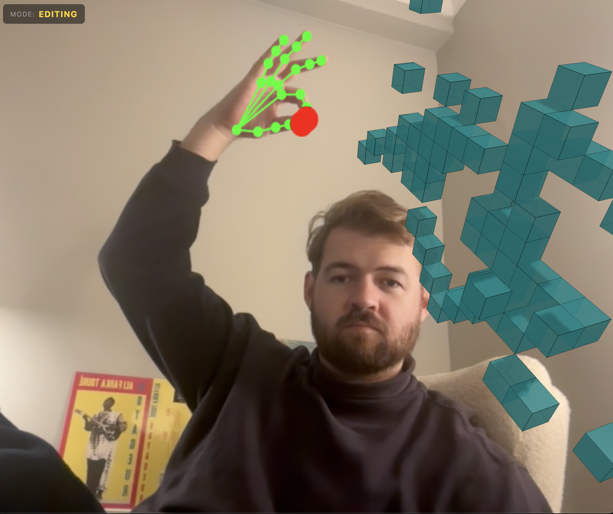

# Blocks AI

**Build 3D voxel creations with just your hands** — A gesture-controlled voxel editor powered by real-time hand tracking and WebGL.



## Overview

Blocks AI transforms your webcam into a gesture-controlled 3D modeling interface. Using MediaPipe's hand tracking and Three.js rendering, you can create colorful voxel structures in 3D space simply by pinching and pointing — no mouse, keyboard, or controller required.

## Features

- **Real-time Hand Tracking** — Precise finger and thumb position detection using your webcam
- **Gesture-Based Mode Switching** — Three intuitive interaction modes:
  - 🤚 **Ready Mode**: No pinches — idle state with hand visualization
  - ✊ **Editing Mode**: One pinch — create voxels at your fingertip in 3D space
  - ✌️ **Orbiting Mode**: Two pinches — rotate camera view around your creation
- **Live Video Overlay** — See your hands with real-time landmark tracking visualization
- **Interactive 3D Grid** — Snap-to-grid placement with depth-based positioning
- **Colorful Voxels** — Each block gets a unique vibrant color

## Quick Start

```bash
# Install dependencies
npm install

# Start development server
npm run dev
```

Then open your browser to `http://localhost:5173` and allow webcam access when prompted.

## How to Use

1. **Position yourself** — Sit in front of your webcam with good lighting
2. **Ready Mode** — Keep your hands open to observe hand tracking
3. **Create blocks** — Pinch your thumb and index finger together with one hand, then move your finger to place voxels in 3D space
4. **Rotate view** — Pinch with both hands simultaneously and move them to orbit the camera around your creation
5. **Build freely** — Switch between modes naturally by changing your hand gestures

## Technology Stack

- **[MediaPipe Tasks Vision](https://developers.google.com/mediapipe)** — ML-powered hand landmark detection
- **[Three.js](https://threejs.org/)** — WebGL-based 3D rendering and scene management
- **[Vite](https://vitejs.dev/)** — Lightning-fast development and optimized builds

## Project Structure

```
blocks-ai/
├── index.html          # App entry point
├── main.js            # Core application logic (hand tracking, gestures, voxel system)
├── style.css          # UI styling
└── public/            # Static assets including MediaPipe models
```

## Browser Compatibility

Requires a modern browser with WebGL and webcam support (Chrome, Edge, Firefox, Safari 15+).

## Development

```bash
npm run build        # Build for production
npm run preview      # Preview production build
```
